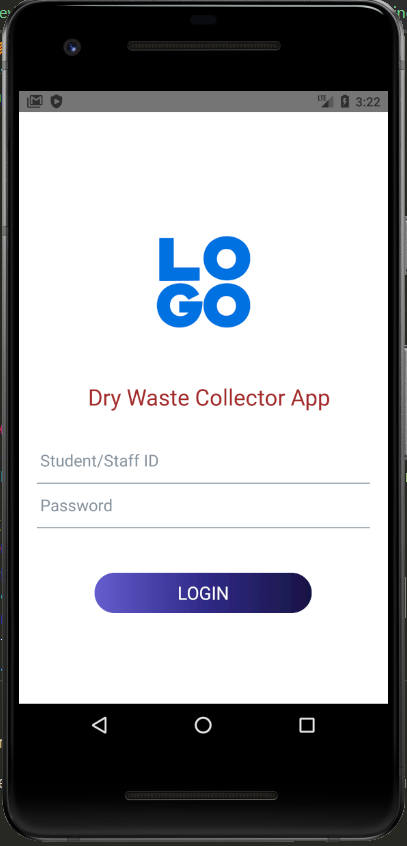

# WasteCollectionApp

This is an React Native App, the code is near to Android site.

User could place booking to book a vehicle to collect the recycle waste. 
User main feature will be place booking, view booking status and lastly see the tracking of the driver with time and distance estimation that need to come o theirs place.

Driver with be assign to collect the waste.
Driver main features with be see comfirmed bookings, select new booking to comfirm, start the tracking to notigy users the driver is coming.

by Teddo_Code

